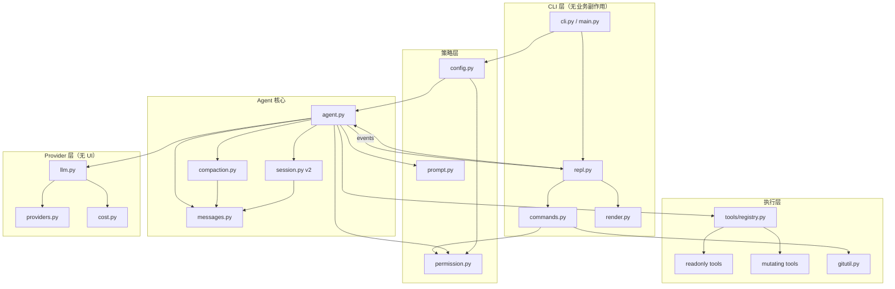
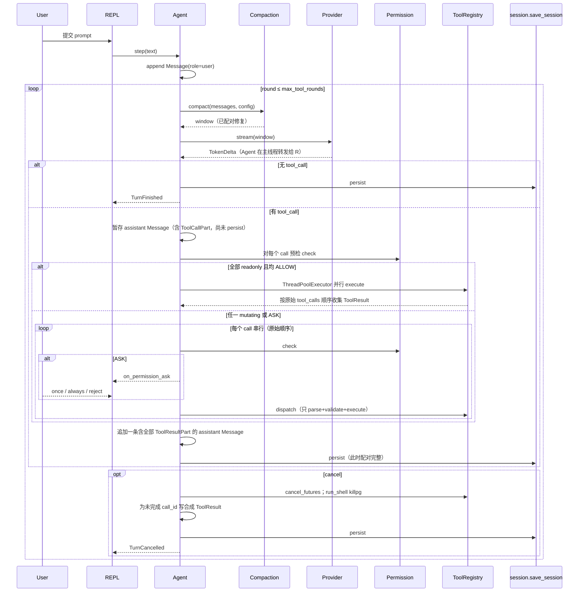
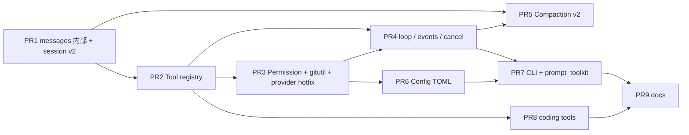

# mini-agent 0.3 全局架构改造实现文档

| 字段 | 值 |
| --- | --- |
| 标题 | mini-agent 0.3：可增量交付的本地 Coding Agent 架构改造 |
| 作者 | TBD（项目 owner + 实施工程师） |
| 日期 | 2026-08-24 |
| 状态 | **Approved**（评审 3 轮通过 + owner 拍板 10 项，2026-08-24） |
| 当前版本 | `0.2.0`（PyPI: `chiv-mini-agent`） |
| 目标版本 | `0.3.0` |
| 仓库 | `/Users/chiv/developer/mini_agent` |
| 分支 | `feat/opencode-architecture` @ `94c8356` |
| 规模 | 源码约 3.4k LOC + 测试约 1.7k LOC，合计 ~5.1k |
| 主要先验 | OpenCode（session / permission / provider / tool registry / message parts / compaction）——**借鉴分层，不搬 TypeScript 运行时** |

---

## Overview

`mini-agent` 已经不是规范里的 MVP：它能读写文件、检索代码、跑 shell、流式输出、持久化会话、切换服务商、估费用、提交 git。但产品体感仍像「能跑的脚本拼盘」，而不是一台现代 coding agent。根因不是模型不够，而是 **CLI / Agent / LLM / 工具 / 权限 / 会话 没有分层**：`cli.py`（792 行）和 `Agent._execute_tool`（`agent.py` 116–268）是两个上帝对象；历史是 `list[dict[str, Any]]`；工具 schema 在 Pydantic 与 `llm.get_tool_definitions()` 各写一份；权限是 regex 剧场；上下文压缩只截断旧工具输出；REPL 用 `rich.prompt.Prompt`，不能多行、没有历史；`agent.step()` 期间 Ctrl-C 会杀掉整个进程（`cli.py` 600–605 只捕获 `Exception`）。

本次改造把现有单进程 CLI **就地分层**，保持可黑盒、可离线测试、可 hack，同时补上现代 agent 的骨架：

1. **配置文件**（用户 + 项目）取代纯环境变量。
2. **Provider** 只懂 OpenAI-compatible 流式协议，不懂 UI。
3. **类型化 Message Parts** 取代 raw dict 历史，会话 JSON 版本化；**Chat Completions 线格式冻结**（见 §2.3）。
4. **Tool 协议 + Registry** 取代 if/elif；JSON Schema 从 Pydantic 生成后做 post-process。
5. **Permission 服务**（allow / deny / ask + once/always）覆盖 `run_shell`、斜杠 git、可配置的写操作；敏感路径即使 `edit=allow` 也 always-ask。
6. **Token 感知 compaction**：修剪旧工具输出、去重读文件、可选 LLM 摘要；窗口在裁剪后必须跑配对修复。
7. **可取消的 Agent 循环**：更高轮次预算、只读工具可并行（结果按原始 `tool_calls` 顺序落盘）、结构化事件给 UI。**Ctrl-C 取消当前 turn 是 0.3 必达**（不依赖新输入库）。
8. **瘦 CLI**：事件渲染器 + 斜杠命令注册表。**多行粘贴与 ↑ 历史是 0.3 必达**（PR7 引入 `prompt_toolkit`；输出仍 Rich）。Ctrl-C 取消 turn 在 PR4 交付（无新库）。
9. **编码工具升级**：`read_file` 行区间（content **不含** `L001:` 前缀）；编辑管道（唯一替换保留，语法守卫成为写入路径一等公民）。

交付方式是 **9 个可独立合并的 PR**（PR1 内部存 `list[Message]`，LLM 边界暂保持 `list[dict]`）。不引入 daemon、Electron、TypeScript 重写。

---

## Background & Motivation

### 产品定位（不变）

`mini-agent` 是一个 **轻量、本地、单进程** 的终端编程助手：Python ≥ 3.12、`uv`、Typer + Rich、Pydantic v2、官方 `openai` SDK。它跑在用户指定的 workspace 里，用相对路径沙箱和子进程环境脱敏作为安全底线，通过 OpenAI-compatible API（DeepSeek / OpenAI / Ollama / 通义 / SiliconFlow / Moonshot / 智谱）驱动工具循环。

它 **不是**：多用户平台、IDE 插件主机、带 HTTP 中控的 client-server、容器级沙箱。这些是 OpenCode 的产品形状，不是本仓库的。

### 当前状态（对照代码，已核实）

规范 `CLAUDE_CODE_EXECUTION_SPEC.md` 描述的是 0.1 MVP（Responses API、无写文件、无会话）。实现早已偏离：

| 规范承诺 | 实际（0.2.0） |
| --- | --- |
| OpenAI Responses API + `function_call_output` | `OpenAIChatCompletionsClient`（`llm.py`）；`OpenAIResponsesClient` 只是别名（`llm.py` 490） |
| 不做 write / edit / git / 会话 / 计费 / 流式 | 全部已做 |
| `max_tool_rounds` 建议 8 | 默认仍是 8（`models.AgentConfig`） |
| README「项目代码结构」 | 未列出 `context.py` / `cost.py` / `providers.py` / `repomap.py` / `rules.py` / `session.py` / `syntax_guard.py` / `search_code`；斜杠表还漏了 `/cost`（`/help` 里有） |
| README「MVP 非目标：不支持写文件」 | 与工具表自相矛盾 |
| README 声称支持 Windows | `run_shell` 超时用 `os.killpg`（Unix-only，`shell.py` 217）；0.2 已超售。0.3：cancel 用 `terminate` fallback，**不保证 TUI**，CI 仍 Ubuntu；PR9 README 停止超售 |

Git 演进（`feat/opencode-architecture` @ `94c8356`）：

```
f238427  v0.1.0 TUI + DeepSeek/OpenAI
0b9914e  write_file + edit_file
8b89e7d  GitHub Actions CI
ac498d0  包名改为 chiv-mini-agent（PyPI）
1a2ffc0  streaming + session + resume
a278def  provider presets + rules + compaction + git + -p
1945c4a  token / cost
ab6800c  DeepSeek V4 + /cost set|list
cebe76f  v0.2.0 search_code
94c8356  repo map + syntax_guard
```

### 现状分层（真实调用链）

```
main.py
  └─ cli.py  (Typer + Rich REPL + slash + git subprocess + dotenv + provider 切换)
       └─ Agent.step()                         # agent.py
            ├─ compact_history(history: list[dict])   # context.py，按条数截断
            ├─ LLMClient.create_response(history, tools, on_token)
            │     └─ OpenAIChatCompletionsClient      # llm.py，Chat Completions stream
            └─ Agent._execute_tool() if/elif
                  ├─ tools/filesystem.py   read/list/search/edit/write
                  ├─ tools/shell.py        regex 黑名单 + 小白名单 + y/N
                  └─ repomap.generate_repo_map()  内联在 agent.py，且
                     workspace_root / inp.path     **未走 resolve_relative_path**
```

`cli.py` 直接操作 `agent.config`、`agent.llm_client`、`agent.session`、`agent.history`、`agent.__init__()`，并自己 `subprocess.run(["git", "add", "."], ...)`（`cli.py` 536，**完整继承 os.environ**，不走 `sanitize_environment`）。

### 痛点（按严重度）

**P0 — 架构无法扩展**

1. **上帝 CLI**：`cli.py` 792 行。加一个工具要改：`models.py`、`llm.get_tool_definitions()`、`agent._execute_tool`、`cli.RichAgentEventListener.on_tool_start`（110–156 行硬编码）、`llm.get_system_prompt`、README、测试。
2. **上帝 Agent**：`_execute_tool` 七路 if/elif。`get_repo_map` 不在 `tools/`。`/new` 先 `generate_session_id()` 打印，再 `agent.__init__()` 生成 **另一个** id（`cli.py` 569–578）——UI 撒谎。
3. **无 Tool Registry**。

**P0 — 协议混乱**

4. 历史混着 Chat Completions（`role: assistant` + `tool_calls`，以及偶发 `role: tool`）和 Responses 风格（`type: function_call_output`，**无 `name` 字段**）。`_convert_messages` 对未知 shape **静默丢弃**。
5. 工具 JSON Schema 与 Pydantic 重复；`SearchCodeInput.max_results` 在模型里有、手写 schema 里没有。`_convert_tools` **已经丢掉 `strict`**（`llm.py` 258–275）——线上从未发送 `strict`。

**P1 — Agent 循环偏弱**

6. 工具串行；`max_tool_rounds=8`。
7. `agent.step()` 期间 Ctrl-C 杀进程。
8. 无 retry/backoff。
9. 流式 tool_call 按 `index` 累加后以 `dict.values()` 发出（**未按 index 排序**，`llm.py` 335–368）；空 name / 半截 JSON 缺少校验。

**P1 — 上下文幼稚**

10. `compact_history` 保留最近 8 条、旧 tool 输出折成 ~250 字符。碰巧不删行所以配对还在；一旦按 token 切窗口就会碎。

**P1 — 编码质量薄**

11. `read_file` 整文件 100 KiB 硬顶（`tests/test_filesystem.py` 断言 `ok is False` / `体积过大`）。
12. `edit_file` 唯一字符串替换（策略正确），无 `replace_all`。
13. `syntax_guard` 是工具内部 import，不是显式管道。
14. 文件写入非原子（session 倒是 tmp+replace）。

**P1 — 安全是剧场**

15. shell regex 拦不住 `python -c` / 组合拳。
16. `/commit` 的 `["git", "add", "."]` 是真实漏洞。`run_shell` 黑名单也 **没有** `git add .` / `git add -A`。
17. `get_repo_map` 用 `workspace_root / inp.path` 直接 `os.walk`，`../outside` 可扫出工作区。
18. 环境脱敏与路径沙箱必须保留。

**P2 — 配置与 UX**

19. 无 config.toml。`/provider`：`except Exception: pass`（`cli.py` 462–463），失败仍打印「已成功切换」。
20. Rich Prompt 单行、无历史。
21. README 过期。`/resume` 换 `agent.history` **不重载 `session_usage`**（`cli.py` 553–556 vs `Agent.__init__` 104–109）——现存 bug，PR7 修。

**P2 — 无扩展面**

22. 无 MCP / skills / subagent。0.3 **明确不做**。

---

## Goals & Non-Goals

### Goals（0.3 必须交付）

1. **可感知的产品升级**：Ctrl-C 取消当前 turn 而不是杀进程（PR4，无新库）；**多行粘贴与 ↑ 命令历史**（PR7，`prompt_toolkit` 负责输入，Rich 负责输出）；工具 UI 不再按名称硬编码；`/commit` 不再 `git add .`；`/provider` 失败不再假装成功。
2. **分层清晰、可测试**：FakeLLM、FakePermission、FakeTool；clock 可注入（`monotonic`）；会话目录仍用现有 `MINI_AGENT_SESSIONS_DIR`。**不**引入 Fake FS 或 `SessionStore` 协议。100% 离线 FakeLLM 不变量保持。
3. **加工具不再改 6 处**：`Tool` 协议 + Registry；schema / UI 摘要 / system prompt **工具列表**自动派生。准则 1–6 正文保持 `llm.py` 现有中文原文。
4. **会话可迁移**：磁盘 `schema_version: 2`；v1 只读兼容；配对失败的文件当 corrupt（`load_session` 返回 `None`）。
5. **权限成为一等公民**：allow / deny / ask；once / always / reject。覆盖 `run_shell`、斜杠 git、edit/write。敏感路径 always-ask。
6. **循环够用**：默认 `max_tool_rounds=32`；只读工具可并行；取消令牌；doom-loop 见 §6.4（**成功的 read/list/search/repomap 永不 doom**）。
7. **上下文够用**：token 估算 + prune + dedup + 可选摘要；**窗口与磁盘都遵守配对不变量**（§2.4）。
8. **编码工具够用**：`read_file` 的 `offset`/`limit`；`edit_file` + `replace_all`；写入路径「校验 → syntax_guard → 原子写」。无区间且 >100 KiB **保持 0.2 拒绝**（不改 `test_read_oversized_file`）。无 `apply_patch` / `edits[]`。
9. **配置文件**：`~/.mini-agent/config.toml` + `.mini-agent.toml`；优先级见 §1。
10. **增量可合并**：见 PR Plan。

### Non-Goals（0.3 明确不做）

| 不做 | 原因 |
| --- | --- |
| TypeScript / Electron / 桌面壳 | 与「可 hack 的 Python CLI」冲突 |
| 常驻 daemon / 本地 HTTP server | 单进程；daemon 会让 Ctrl-C、测试、发布全面变复杂 |
| MCP / Subagent / Skills | 0.4+（owner 2026-08-24） |
| `apply_patch` / `edits[]` | 0.3 只做 unique replace + `replace_all` |
| 官方 Responses API 作为主协议 | 国内主流是 Chat Completions |
| 容器 / OS 级沙箱 | README 诚实声明 |
| 展示思维链 | `ReasoningPart` 不实现 |
| Textual 全屏 TUI | 输入用 `prompt_toolkit`，输出用 Rich |
| 强制 test-after-edit | 只写进 system prompt |
| Fake 文件系统抽象 | 测试继续用 `tmp_path` |
| 把 `mini-agent` 宣称成 Claude Code | 期望管理 |
| 正式承诺 Windows TUI | cancel 仅 `terminate` fallback；CI 仍 Ubuntu |

### 成功标准（可验收）

- 新贡献者只改 `tools/` + 一处 `register` 就能加只读工具；`/help` 与 system prompt **工具列表**自动包含它。
- `uv run pytest` 零网络。
- 0.2 的 `~/.mini-agent/sessions/*.json` 能被 `--continue` 打开（配对完好的文件）。
- **流式输出中 Ctrl-C → 回到 `>`，已完成的 tool 结果已保存，磁盘上无未配对 `tool_call`。** 能粘贴多行代码；↑ 翻历史（`prompt_toolkit` 输入 + Rich 输出）。
- 非白名单 `run_shell` 出现 once / always / reject。
- `/commit` 执行 `git add -u` + `git commit`，永不 `git add .`；`run_shell` 黑名单同样拒绝 `git add .` / `git add -A`。
- README 与真实功能一致，且斜杠表含 `/cost`（PR9）。

---

## Proposed Design

### 设计原则

1. **就地分层，不换壳。** 方案 A。方案 A 的实施切片：PR1 内部 Message、线格式仍走现有 v1 dict（见 Alternatives）。
2. **Registry + Protocol，禁止新的 if/elif 分发。** PR2 删除工具名分支，但 **confirm 仍留在 Agent** 直到 PR3。
3. **类型化消息是会话真相。** PR1 起 Agent 存 `list[Message]`。PR1–PR3：`LLMClient.create_response(history: list[dict])` 不变，由 `messages_to_v1_history` 投影。PR4 起 Provider 吃 `list[Message]`，`to_chat_messages` 成为 **唯一** 生产 Chat Completions dict 的函数。
4. **UI 只消费事件。** `agent.py` 不得 import `rich`。Agent 通过 listener/事件把输出交给 REPL，REPL 再交给 `render.py`。
5. **安全默认保守，路径沙箱与环境脱敏不放松。** 所有文件工具（含 `get_repo_map`）必须走 `resolve_relative_path`。
6. **可注入。** LLM、permission prompt、`monotonic`、`MINI_AGENT_SESSIONS_DIR`。文件系统保持真实 `Path`。

### OpenCode 概念映射（借鉴，不搬运）

| OpenCode（先验） | 本仓库 0.3 模块 | 适配说明 |
| --- | --- | --- |
| `Config` | `config.py` | TOML + env + flags；3.12 `tomllib` |
| `Provider` | `llm.py` | 只做 Chat Completions；`to_chat_messages()` 在 `messages.py` |
| `MessageV2.Part` | `messages.py` | text / tool_call / tool_result / usage / compaction |
| `Session` | `session.py` v2 | 仍是 `~/.mini-agent/sessions/<id>.json`；函数而非 Store 协议 |
| `ToolRegistry` | `tools/protocol.py` + `registry.py` | 显式 register |
| `PermissionNext` | `permission.py` | `PermissionClass` 放 `models.py` 以免循环 |
| `SessionCompaction` | `compaction.py` | prune → 配对修复 → 可选摘要 → 整回合硬裁 |
| `SessionPrompt` | `agent.py` `step()` | 一个循环 |
| TUI / 斜杠 | `cli.py` + `commands.py` | 输入 `prompt_toolkit`；输出 Rich |
| MCP / Plugin / Skill / LSP | **不做** | |

### 目标目录树

```text
src/mini_agent/
  __init__.py                 # __version__ = "0.3.0"
  main.py
  models.py                   # AgentConfig、ToolResult、PermissionClass、各 Input
  messages.py                 # NEW：Message / Part / 迁移 / to_chat_messages
  events.py                   # NEW（PR4）：AgentEvent
  config.py                   # NEW（PR6）
  session.py                  # schema v2 + v1 迁移
  compaction.py               # 由 context.py 演进（PR5）
  permission.py               # NEW（PR3）
  agent.py                    # 瘦循环：step / reset_session / cancel
  llm.py                      # Chat Completions 适配器
  prompt.py                   # NEW（PR2）：拼 system prompt
  providers.py
  cost.py
  rules.py
  syntax_guard.py
  repomap.py
  gitutil.py                  # NEW（PR3）
  cli.py
  commands.py                 # NEW（PR7）
  repl.py                     # NEW（PR7）；prompt_toolkit 输入
  render.py                   # NEW（PR7）；Rich 输出
  tools/
    __init__.py               # default_registry()
    protocol.py               # Tool / ToolContext / ToolKind / ToolCancelled
    registry.py
    filesystem.py
    shell.py
```

### 逻辑架构



单向依赖（禁止环）：

```
main → cli → repl → agent
commands → permission, gitutil, session, config
agent → llm, tools.registry, permission, compaction, session, messages, events, prompt, cost
tools/protocol → models          # PermissionClass 在 models.py
tools/registry → tools/protocol, models, syntax_guard
permission → models
llm → messages, cost, providers
config → models
compaction → messages
session → messages, models
```

`cli` / `repl` / `render` **不得** import `openai` SDK。`permission.py` **不得** import `tools.protocol`。

### 一次用户 turn 的时序



---

### 1. Config

**文件位置**

| 层 | 路径 | 作用 |
| --- | --- | --- |
| 内置默认 | `config.defaults()` | `AppConfig` |
| 用户 | `~/.mini-agent/config.toml` | 服务商、模型、权限、limit |
| 项目 | `<workspace>/.mini-agent.toml` | 覆盖权限与 limit（可进 git，**禁止放密钥**） |
| 环境 | 见下表 | 密钥只走环境或 workspace `.env` |
| CLI | `-w -m -b -p -c -s -v -y --config` | 最高优先级 |

**环境变量清单**（现有 + 保留）

| 变量 | 用途 |
| --- | --- |
| `OPENAI_API_KEY` | 密钥 |
| `OPENAI_BASE_URL` / `OPENAI_API_BASE` | 兼容 base url |
| `MINI_AGENT_MODEL` | 模型 |
| `MINI_AGENT_SESSIONS_DIR` | 会话目录（测试已用） |
| `MINI_AGENT_PRICING` | 行内费率覆盖 |
| `MINI_AGENT_PRICING_FILE` | 费率 JSON 路径（`cost.py` 61–65，0.3 必须继续认） |
| `MINI_AGENT_DEBUG` | 可选 debug.log |

**合并顺序（高覆盖低）**

1. 启动时对 workspace 调现有 `load_dotenv`：**不覆盖**已在 `os.environ` 里的键。
2. 然后： **CLI 旗标 > 进程环境（此时已含 dotenv）> 项目 TOML > 用户 TOML > 代码默认**。
3. TOML 里若出现 `api_key` / `openai_api_key` / `OPENAI_API_KEY`：**忽略并 warning**，永不采用。
4. `ProviderConfig.name` 先展开预设（`base_url` + `default_model`）；**显式 `base_url` 覆盖预设**；显式 `model` 覆盖预设默认模型。

`AgentConfig` 保留为一次运行的冻结视图。现有测试继续 `AgentConfig(workspace_root=tmp_path)`。

```python
class LimitsConfig(BaseModel):
    max_tool_rounds: int = Field(default=32, ge=1, le=200)
    shell_timeout_seconds: int = Field(default=30, ge=1)
    max_output_chars: int = Field(
        default=12_000, ge=1024
    )  # 与 0.2 AgentConfig 一致；不静默改成 16k
    context_window_tokens: int = Field(default=128_000, ge=4000)
    compaction_buffer_tokens: int = Field(default=8_000, ge=1000)
    keep_recent_tokens: int = Field(default=24_000, ge=2000)
    max_parallel_readonly: int = Field(default=4, ge=1, le=8)
    auto_summarize: bool = True  # owner 拍板默认开；失败则整回合硬裁；测试可关


class PermissionConfig(BaseModel):
    read: str = "allow"
    edit: str = "allow"  # owner 拍板全局 allow；敏感路径仍 always-ask
    shell: str = "ask"
    git: str = "ask"
```

`context_window_tokens` **不是**按模型自适应。Ollama 32k 等小窗口由用户在 TOML 里改；配错会在 compaction 之前撞 API 400，verbose 下打印「估算 token / 配置窗口」。0.3 不给每个 preset 填窗口。

加载用 `tomllib`。**0.3 不从程序回写 TOML。** `/provider` 只改当前会话，失败必须抛给 UI。

`~/.mini-agent` 目录 `mkdir(..., 0o700)`（PR1，若尚未如此）。

---

### 2. Message 模型

#### 2.1 类型

```python
# src/mini_agent/messages.py
from datetime import datetime
from typing import Annotated, Any, Literal
from uuid import uuid4
from pydantic import BaseModel, Field


def _now_iso() -> str:
    return datetime.now().isoformat()


class TextPart(BaseModel):
    type: Literal["text"] = "text"
    text: str


class ToolCallPart(BaseModel):
    type: Literal["tool_call"] = "tool_call"
    call_id: str
    name: str
    arguments: str  # 模型给出的原始 JSON 字符串


class ToolResultPart(BaseModel):
    type: Literal["tool_result"] = "tool_result"
    call_id: str
    name: str
    ok: bool
    content: str = ""
    error: str | None = None
    metadata: dict[str, Any] = Field(default_factory=dict)


class UsagePart(BaseModel):
    type: Literal["usage"] = "usage"
    prompt_tokens: int = 0
    completion_tokens: int = 0
    total_tokens: int = 0
    cost_cny: float = 0.0
    estimated: bool = False


class CompactionPart(BaseModel):
    type: Literal["compaction"] = "compaction"
    summary: str
    dropped_count: int = 0


Part = Annotated[
    TextPart | ToolCallPart | ToolResultPart | UsagePart | CompactionPart,
    Field(discriminator="type"),
]


class Message(BaseModel):
    id: str = Field(default_factory=lambda: uuid4().hex[:12])
    role: Literal["system", "user", "assistant"]
    parts: list[Part] = Field(default_factory=list)
    created_at: str = Field(default_factory=_now_iso)
```

`UsagePart` 只挂在会话里做 `/cost`，**从不**进入 Chat Completions 请求。`truncated` 不作为 Part 字段；进 `metadata["truncated"]`，与 0.2 `ToolResult` 一致。

#### 2.2 会话内布局（0.3 选定，无「或」）

一轮若模型同时返回文本 + N 个 tool call，磁盘上连续两条 assistant 消息：

1. `role=assistant`，`parts = [TextPart?…] + N × ToolCallPart`（顺序 = 模型 `tool_calls` 顺序）。
2. `role=assistant`，`parts = N × ToolResultPart`（同一顺序，同一组 `call_id`）。

`ToolResultPart` **只**出现在这种「结果消息」里，不出现在 user/system 里。持久化 **没有** `role=tool` 行。

`CompactionPart` **只**出现在 `role=user` 消息、且紧挨在 system 之后：`Message(role="user", parts=[CompactionPart(...)])`。**永不**改写 system 的 `TextPart`（prompt cache）。

#### 2.3 Chat Completions 往返表（线格式冻结）

0.2 线上请求是：

```
assistant: {role, content?, tool_calls: [{id, type:"function", function:{name, arguments}}]}
tool:      {role:"tool", tool_call_id, content}   # content = ToolResult.model_dump_json()
```

`tests/test_agent.py` 84–88、148–154 锁住 `function_call_output` 与 JSON `{"ok": true, ...}`。**PR1 不得把 `role=tool` 的 content 改成纯文本。**

`to_chat_messages(messages: list[Message]) -> list[dict]`（定义在 `messages.py`）按下表展开。这是 PR4 之后唯一的 dict 生产者；PR1 用它做黄金测试，线上仍走 `_convert_messages`。

| 输入 Message | 输出 dict 行 |
| --- | --- |
| `role=system` + `TextPart` | `{role:"system", content: text}` |
| `role=user` + 仅 `TextPart` | `{role:"user", content: text}` |
| `role=user` + `CompactionPart` | `{role:"user", content: "[上下文摘要]\n" + summary}`。若同条还有 TextPart，先摘要后文本，用 `\n\n` 连接 |
| `role=assistant` + `TextPart` 且无 ToolCallPart | `{role:"assistant", content: text}` |
| `role=assistant` + 可选 TextPart + N ToolCallPart | **一条** `{role:"assistant", content?: text, tool_calls:[{id: call_id, type:"function", function:{name, arguments}} × N]}`。没有 tool_calls 的 assistant 再后跟 tool 行是非法序列 |
| `role=assistant` + N ToolResultPart | **N 条** `{role:"tool", tool_call_id: call_id, content: ToolResult(ok, content, error, metadata).model_dump_json()}` |
| 任何 `UsagePart` | **跳过** |
| 未知 part | 跳过（测试锁：不得因此丢掉已配对的 call/result） |

`ToolResult.model_dump_json()` 字段顺序与 0.2 Pydantic 默认一致（`ok, content, error, metadata`）。prune 只改 `content`（及必要时 `metadata`），**信封不变**。

**黄金测试（PR1 验收，必须先写）：**

```python
v1 = GOLDEN_V1_HISTORY  # 见 §2.5 fixture
assert OpenAIChatCompletionsClient._convert_messages(v1) == to_chat_messages(
    history_v1_to_messages(v1, created_at="2026-08-18T10:00:00")
)
```

`messages_to_v1_history` 是逆投影，供 PR1 的 `Agent.history` property，让 `tests/test_agent.py` 现有 `item.get("type") == "function_call_output"` 断言不改。与 `to_chat_messages` 相同，**跳过 `UsagePart` / `CompactionPart`**（PR1 的磁盘投影里本来也不会写出它们）。

#### 2.4 持久化配对不变量

对磁盘上的 `messages` 以及每一次 `save_session`：

- 若某条 assistant 消息含有一个或多个 `ToolCallPart`，则 **下一条** 消息必须是 assistant，且其 `ToolResultPart.call_id` 集合 **等于** 这些 `ToolCallPart.call_id`（不多不少）。
- 违反此条的消息 **不得写入磁盘**。调用方必须先：
  - **补** 合成 `ToolResultPart`（`ok=False, error="用户取消"` / `"检测到重复工具调用"` / `"工具调用轮数已达到上限"` 等），或
  - **丢** 那条未完成的 tool-call 消息（仅当该轮尚未开始执行任何工具、例如流式中途取消且只攒了半截 tool_calls）。
- `max_tool_rounds` 用尽：与 0.2 相同，**已经执行完的** function 结果必须落盘，然后再追加超时文本。

`load_session` 对 v2：若发现违反不变量 → 视为 corrupt，返回 `None`（与坏 JSON 相同）。

#### 2.5 v1 → v2 迁移（状态机，不是四行对照表）

0.2 `Agent.step` 实际写入顺序（`llm.py` 387–391 / 457–461，`agent.py` 347–354）：

1. `{role:"assistant", content?, tool_calls:[{id, type:"function", function:{name, arguments}}]}`
2. N 条 `{type:"function_call_output", call_id, output: ToolResult.model_dump_json()}` —— **没有 `name`**
3. 无 per-item 时间戳

**字段映射**

| v1 | v2 |
| --- | --- |
| `tool_calls[].id` | `ToolCallPart.call_id` |
| `tool_calls[].function.name` | `ToolCallPart.name` |
| `tool_calls[].function.arguments` | `ToolCallPart.arguments` |
| `function_call_output.call_id` 或 `role=tool` 的 `tool_call_id` | `ToolResultPart.call_id` |
| `function_call_output.output` 或 `role=tool` 的 `content` | 解析为 `ToolResult`；失败则 `ok=False, content=raw, error="工具参数不是合法的 JSON 字符串: …"` 不适用于此处——结果侧解析失败用 `ok=False, content=raw, error=None, metadata={}` |
| `ToolResultPart.name` | 仅从 **当前未闭合回合** 的 `open_calls[cid]`（即刚写入的那条 assistant `tool_calls[].id`）取 `function.name`。`cid not in open_calls` → `UnpairedToolError`，**不做**跨回合全局 lookup |

**不**增加 `SessionMeta.migration_notes`（避免 schema 膨胀）。`created_at`：所有迁移出的 Message 填 `meta.created_at`（v1 没有逐条时间）。新消息用 `default_factory=_now_iso`。

**resume 时的 system prompt：保留磁盘上那条 v1 system 字符串，不调用 `get_system_prompt` 重生。** 重生会改模型已经见过的前缀。新会话才用当前 `prompt.py`。

**状态机 `history_v1_to_messages(items: list[dict], created_at: str) -> list[Message]`**

`created_at` 填到每条迁出 Message；调用方传入 `meta.created_at`。结果 **只** 挂到当前未闭合回合（`open_calls`），禁止跨回合 lookup。

```
open_calls: dict[call_id, name]     # 仅本轮 assistant.tool_calls，插入序
pending_results: list[ToolResultPart]
out: list[Message]

flush_results(*, eof: bool) -> None:
    if not pending_results and not open_calls:
        return
    if eof and not pending_results and open_calls:
        # 崩溃中的 v1：末尾只有 tool_calls、没有任何 result → 丢掉悬挂的 call 消息
        assert out and any(isinstance(p, ToolCallPart) for p in out[-1].parts)
        out.pop()
        open_calls.clear()
        return
    if set(p.call_id for p in pending_results) != set(open_calls):
        raise UnpairedToolError  # 多 result、未知 cid、或回合中途缺 result
    # 按 open_calls 插入序重排
    ordered = [next(p for p in pending_results if p.call_id == cid) for cid in open_calls]
    out.append(Message(role="assistant", parts=ordered, created_at=created_at))
    pending_results.clear(); open_calls.clear()

for item in items:
    role, typ = item.get("role"), item.get("type")
    if typ == "function_call_output" or role == "tool":
        cid = item.get("call_id") or item.get("tool_call_id")
        if cid not in open_calls:
            raise UnpairedToolError  # 含：cid 只存在于更早回合；或根本没有 call
        name = open_calls[cid]
        raw = item.get("output") or item.get("content") or ""
        try:
            data = json.loads(raw) if isinstance(raw, str) else raw
            tr = ToolResult.model_validate(data)
        except Exception:
            tr = ToolResult(ok=False, content=str(raw))
        pending_results.append(ToolResultPart(call_id=cid, name=name, ok=tr.ok, ...))
        continue

    flush_results(eof=False)

    if role in ("system", "user"):
        out.append(Message(role=role, parts=[TextPart(text=item.get("content") or "")], created_at=created_at))
    elif role == "assistant" and item.get("tool_calls"):
        parts = []
        if item.get("content"):
            parts.append(TextPart(text=item["content"]))
        for tc in item["tool_calls"]:
            cid = tc["id"]
            name = tc["function"]["name"]
            args = tc["function"]["arguments"]
            parts.append(ToolCallPart(call_id=cid, name=name, arguments=args))
            open_calls[cid] = name
        out.append(Message(role="assistant", parts=parts, created_at=created_at))
    elif role == "assistant" or typ == "message":
        out.append(Message(role="assistant", parts=[TextPart(text=item.get("content") or "")], created_at=created_at))
    else:
        continue  # 未知 shape：跳过，不 abort

flush_results(eof=True)
return out
```

`UnpairedToolError` → `load_session` 返回 `None`。

**`load_session` 双读（函数级）**

```python
def load_session(session_id: str, sessions_dir: Path | None = None) -> SessionData | None:
    path = (sessions_dir or get_default_sessions_dir()) / f"{session_id}.json"
    if not path.is_file():
        return None
    try:
        data = json.loads(path.read_text(encoding="utf-8"))
    except (OSError, json.JSONDecodeError):
        return None
    version = data.get("schema_version", 1)
    try:
        if version == 1:
            meta = SessionMeta.model_validate(data["meta"])
            messages = history_v1_to_messages(data.get("history") or [], created_at=meta.created_at)
            return SessionData(schema_version=2, meta=meta, messages=messages, permission_memory=[])
        if version == 2:
            sess = SessionData.model_validate(data)
            assert_pairing(sess.messages)  # 违例 → 走 except
            return sess
        return None  # 未知版本
    except (UnpairedToolError, ValidationError, KeyError, AssertionError):
        return None
```

`save_session` **只写 v2**（`schema_version: 2`, `messages`, `permission_memory`），**不**镜像 `history`。0.2 读 0.3 文件会失败；CHANGELOG 写明升级前 `cp -r ~/.mini-agent/sessions`。0.3 读 0.2 必须成功。下次 save 即升 v2。

**GOLDEN_V1_HISTORY fixture**（写入 `tests/fixtures/session_v1_tool_round.json`，形状与 `test_agent.py` 一致）：

```json
[
  {"role": "system", "content": "You are assistant."},
  {"role": "user", "content": "读 a.txt 和 b.txt"},
  {
    "role": "assistant",
    "tool_calls": [
      {"id": "call_read_a", "type": "function", "function": {"name": "read_file", "arguments": "{\"path\": \"a.txt\"}"}},
      {"id": "call_read_b", "type": "function", "function": {"name": "read_file", "arguments": "{\"path\": \"b.txt\"}"}}
    ]
  },
  {"type": "function_call_output", "call_id": "call_read_a", "output": "{\"ok\": true, \"content\": \"AAA\", \"error\": null, \"metadata\": {\"path\": \"a.txt\"}}"},
  {"type": "function_call_output", "call_id": "call_read_b", "output": "{\"ok\": true, \"content\": \"BBB\", \"error\": null, \"metadata\": {\"path\": \"b.txt\"}}"},
  {"role": "assistant", "content": "文件 a 的内容是 AAA，文件 b 的内容是 BBB。"}
]
```

迁移后 **5 条 Message**（system, user, assistant-with-2-calls, assistant-with-2-results, assistant-text）——上面 **6 个 dict → 5 条 Message**。`to_chat_messages` 必须还原 `_convert_messages` 的 tool 行顺序与 JSON content。

---

### 3. Tool 系统

`PermissionClass` 放在 **`models.py`**（`READ/EDIT/SHELL/GIT`），PR2 即可引用，避免 `protocol.py` ↔ `permission.py` 循环。

```python
# tools/protocol.py
class ToolKind(StrEnum):
    READONLY = "readonly"
    MUTATING = "mutating"


class ToolCancelled(Exception):
    """ctx.check_cancel() 在 cancel 置位时抛出。Agent.step 必须捕获并转为 ToolResult。"""


class ToolContext:
    def __init__(
        self, workspace_root: Path, config: AgentConfig, cancel: threading.Event
    ) -> None: ...

    # 不含 permission、不含 listener、不含 confirmed。
    # 授权发生在 Agent；能进 execute 即已授权。


class Tool(Protocol):
    name: str
    description: str  # 中文，来自现有 get_tool_definitions()，不是 Pydantic docstring
    permission: PermissionClass
    kind: ToolKind
    input_model: type[BaseModel]

    def execute(self, inp: BaseModel, ctx: ToolContext) -> ToolResult: ...
    def format_call(self, inp: BaseModel) -> str: ...
    def approval_pattern(self, inp: BaseModel) -> str: ...
```

**`Registry.dispatch` = JSON 解析 + Pydantic 校验 + `execute`。不做 permission.check。**

错误字符串与 0.2 逐字兼容（测试依赖）：

| 条件 | error |
| --- | --- |
| `json.loads` 失败 | `工具参数不是合法的 JSON 字符串: {exc}` |
| JSON 不是 object | `工具参数必须为 JSON 对象 (dict)，收到: {type}` |
| 未知工具名 | `未知的工具名称: '{name}'` |
| Pydantic 失败 | `{name} 参数校验失败: {exc}`（现有各工具文案） |

空 `name`（流式拼出来是 `""`）：当未知工具，走同一中文错误，**不调用 execute**。

```python
class ToolRegistry:
    def register(self, tool: Tool) -> None: ...
    def get(self, name: str) -> Tool | None: ...
    def list(self) -> list[Tool]: ...
    def json_schemas(self, *, send_strict: bool = False) -> list[dict]: ...
    def dispatch(self, name: str, raw_arguments: str, ctx: ToolContext) -> ToolResult: ...
```

**Schema post-process（行为冻结关键）：**

1. `input_model.model_json_schema()`，flatten `$defs`。
2. 根对象设 `additionalProperties: false`（手写 schema 现状，`llm.py` 105–238）。
3. **默认不发送 `strict`。** 仅当 provider allowlist（0.3 空集；日后 OpenAI 官方可加）才带 `strict: true`。0.2 的 `_convert_tools` 已经丢 `strict`，PR2 继续丢。
4. `description` 用 `Tool.description` 中文字符串，不用 Field 英文。
5. `SearchCodeInput.max_results` **进入 schema**（允许的可见 bugfix）。

**system prompt（PR2 冻结）**

- `get_system_prompt` 里「请严格遵守以下开发准则：」起的 **准则 1–6 原文逐字保留**（`llm.py` 71–77）。
- 仅工具 bullet 列表改为遍历 registry：``- `{name}`：{description}``，中文 description 从现有 `get_tool_definitions()` 拷到各 Tool。
- 项目 rules 仍经 `rules.load_project_rules`。

**`Agent.__init__`**

```python
def __init__(
    self,
    config: AgentConfig,
    llm_client: LLMClient,
    listener: AgentEventListener | None = None,
    session: SessionData | None = None,
    registry: ToolRegistry | None = None,
    permission: PermissionService | None = None,  # PR3 才真正使用
    monotonic: Callable[[], float] = time.monotonic,
) -> None:
    self.registry = registry or default_registry()
    self._cancel = threading.Event()
```

现有测试 `Agent(config, llm_client)` 继续可运行。

**`run_shell` 授权契约（PR2 冻结，PR3 不改 execute 这一侧）**

0.2 是：Agent 问完 y/N 之后调用 `run_shell(..., confirmed=True)`（`agent.py` 250–256）。`run_shell` 默认 `confirmed=False`，非白名单命令会直接返回 `需要确认` 而不执行（`shell.py` 185–191）。因此 **execute 若漏传 `confirmed=True`，用户按 y 等于没按**。

选定机制（不把 PermissionService 放进 ToolContext）：

1. Agent 只对 **JSON + Pydantic 都成功** 的 `run_shell` 做 confirm peek；非法 JSON / 校验失败 **跳过 peek**，直接 `dispatch`，中文错误仍由 `dispatch` 单点产出。
2. 黑名单在 Agent peek 处短路返回（与 0.2 相同）；`run_shell()` 内部仍再跑一遍 blocklist（纵深防御，`confirmed=True` 也拦不住黑名单）。
3. 用户拒绝 → 返回 `用户拒绝执行命令`，**不**调用 `dispatch`/`execute`。
4. 一旦进入 `RunShellTool.execute`，一律 `run_shell(..., confirmed=True, timeout_seconds=ctx.config.shell_timeout_seconds, max_output_chars=ctx.config.max_output_chars)`。底层 `run_shell()` 函数默认仍是 `confirmed=False`，供 `test_shell.py` 直接测工具层。

```python
def _execute_tool(self, name: str, raw_arguments: str) -> ToolResult:
    tool = self.registry.get(name)
    if tool is None:
        return ToolResult(ok=False, content="", error=f"未知的工具名称: '{name}'")

    if name == "run_shell":
        inp: RunShellInput | None
        try:
            args = json.loads(raw_arguments) if raw_arguments.strip() else {}
            inp = RunShellInput(**args) if isinstance(args, dict) else None
        except (json.JSONDecodeError, ValidationError):
            inp = None  # 让 dispatch 产出与 0.2 相同的中文错误
        if inp is not None:
            is_blocked, req_conf, reason = check_command_safety(inp.command)
            if is_blocked:
                return ToolResult(
                    ok=False,
                    content="",
                    error=reason,
                    metadata={"blocked": True, "command": inp.command},
                )
            if req_conf:
                allowed = bool(self.listener and self.listener.on_tool_confirm(inp.command))
                if not allowed:
                    return ToolResult(
                        ok=False,
                        content="",
                        error=f"用户拒绝执行命令: '{inp.command}'",
                        metadata={"user_cancelled": True, "command": inp.command},
                    )

    ctx = ToolContext(self.config.workspace_root, self.config, self._cancel)
    return self.registry.dispatch(name, raw_arguments, ctx)


class RunShellTool:
    name = "run_shell"
    permission = PermissionClass.SHELL
    kind = ToolKind.MUTATING
    input_model = RunShellInput

    def execute(self, inp: RunShellInput, ctx: ToolContext) -> ToolResult:
        return run_shell(
            inp,
            workspace_root=ctx.workspace_root,
            confirmed=True,
            timeout_seconds=ctx.config.shell_timeout_seconds,
            max_output_chars=ctx.config.max_output_chars,
        )
```

PR3 把上面 `if name == "run_shell"` peek 换成 `self.permission.check` + `on_permission_ask`；**`RunShellTool.execute` 仍然 `confirmed=True`**，ToolContext 仍不含 permission。

**内置工具**

| 工具 | kind | permission | PR2 | 以后 |
| --- | --- | --- | --- | --- |
| `get_repo_map` | readonly | read | 迁入 tools；**必须** `resolve_relative_path`（安全 bugfix，允许打破「行为冻结」） | |
| `search_code` | readonly | read | `max_results` 进 schema | |
| `list_files` | readonly | read | 不变 | |
| `read_file` | readonly | read | 不变（仍 100 KiB 拒绝） | PR8：offset/limit |
| `edit_file` | mutating | edit | 不变 | PR8：replace_all + 原子写 |
| `write_file` | mutating | edit | 不变 | PR8：原子写 |
| `run_shell` | mutating | shell | **仍由 Agent 调 `on_tool_confirm`**（不删 y/N） | PR3 换成 Permission |

`get_repo_map` 截断：`generate_repo_map(..., max_tokens=1500)` 实际按 **`max_tokens * 4` 字符** 截（`repomap.py` 178–181），约 6000 字符，不是 1500 字符。PR2 不改这个公式。

#### 3.1 并行（PR4）

同一 round 的 N 个 call：

- **全部** `kind=readonly` **且** 预检全 ALLOW → `ThreadPoolExecutor(max_workers=min(N, max_parallel_readonly))`。
- 任一 mutating 或 ASK → **全部串行**。
- **执行可以乱序完成；`ToolResultPart` 追加、事件发射必须按原始 `tool_calls` 顺序。** 验收改写：「可乱序完成，但 `call_id` 顺序仍是 a 然后 b」（保住 `test_agent.py` 189–191）。
- worker **只 return ToolResult**，禁止 `Console.print`。Agent 在主线程 `emit ToolStarted`（提交前，按顺序）与 `ToolFinished`（gather 之后，按顺序）。若希望 Started 更及时：主线程在提交前按顺序先发全部 ToolStarted，再 wait。选定：**提交前按顺序发全部 ToolStarted，wait 后按顺序发 ToolFinished。**
- 取消：`executor.shutdown(wait=False, cancel_futures=True)`（3.9+；我们 ≥3.12），然后对未完成的 call 写合成 `ToolResult(ok=False, error="用户取消")`。

#### 3.2 `run_shell` 取消（与超时同一条路径）

`Popen.communicate(timeout=...)` 本身不看 `Event`。实现：

- 把 communicate 放到 helper：与现有 `TimeoutExpired` 分支相同，`os.killpg(SIGTERM)` → 2s → `SIGKILL`（`shell.py` 213–227）。
- cancel：后台线程或 `select` 等到 `cancel.is_set()` 后走 **同一** killpg 路径。
- Windows：`hasattr(os, "killpg")` 为假则 `process.terminate()`，超时后 `kill()`。**不保证 TUI**；CI 仍 Ubuntu；PR9 README 停止超售。
- 结果：`ok=False, error="用户取消", metadata={"user_cancelled": True}`。`ToolCancelled` 不得漏出 `step()`。

`search_code` 每个文件之间 `ctx.check_cancel()`。写文件若已进入 `rename`，让它结束再看 cancel。

---

### 4. Permission

求值在 **Agent / 斜杠 handler**，不在 `dispatch`。

```python
# permission.py — 不 import tools.protocol
class Decision(StrEnum):
    ALLOW = "allow"
    DENY = "deny"
    ASK = "ask"


class Reply(StrEnum):
    ONCE = "once"
    ALWAYS = "always"
    REJECT = "reject"


class PermissionRequest(BaseModel):
    cls: PermissionClass
    tool: str
    resource: str
    pattern: str
    reason: str = ""


class PermissionService(Protocol):
    def check(self, req: PermissionRequest) -> Decision: ...
    def remember(self, req: PermissionRequest, reply: Reply) -> None: ...
    def snapshot(self) -> list[dict]: ...
```

PR3 **只**把 listener 从 `on_tool_confirm(command) -> bool` 扩成 `on_permission_ask(req) -> Reply`。`events.py` 留到 PR4。y/N 快捷键：y=once，n=reject；提示「输入 a = 本会话 always」。默认 reject。

**求值顺序**

1. **敏感写路径**（即使 `edit=allow`）→ ASK，且 always 的 pattern 是 **解析后的相对 POSIX 全路径**（精确，不是 `*`）。匹配在 `resolve_relative_path` 成功之后、对沙箱内相对 POSIX 字符串进行；**大小写敏感**（macOS 默认不敏感磁盘也可接受，比较仍按大小写敏感，避免把 `Env` 当 `.env`）。

   ```python
   def is_sensitive_write_path(rel_posix: str) -> bool:
       parts = rel_posix.split("/")
       name = parts[-1]
       if name == ".env" or name.startswith(".env."):
           return True  # .env / .env.local / backend/.env
       if ".git" in parts:
           return True  # .git / .git/hooks/pre-commit / pkg/.git/config
       if name.endswith(".pem") or name.endswith(".key"):
           return True  # 任意目录
       if name == ".mini-agent.toml":
           return True  # 含 pkg/.mini-agent.toml
       return False
   ```

   权限测试必含：`backend/.env` → ASK；`src/a.py` 且 `edit=allow` → ALLOW。
2. `run_shell` `BLOCKLIST_PATTERNS` → DENY，不可 always。**新增**（PR3）：
   - `\bgit\s+add\s+\.`
   - `\bgit\s+add\s+-[a-zA-Z]*A`（`git add -A` / `-uA` 等含 A 的；**不要**误伤 `git add -u` 单独）
   - 更稳：规范化 argv 后若 `git add` 的某个 pathspec 是 `.` / `-A` / `--all` → DENY
3. 会话记忆：`cls + pattern` **精确匹配**（shell 的 pattern 已是规范化字符串）。`always` 对 `git add .` **永远匹配不到**（已被 DENY）。
4. 配置默认 `PermissionConfig`。
5. shell 白名单且无 `| > >> ; &&` → ALLOW。
6. 否则 ASK。

**`pattern_for_shell(command) -> str | None`**（`None` 表示禁止 always，每次都问）

| command | pattern | 说明 |
| --- | --- | --- |
| `uv run pytest tests/test_agent.py -q` | `uv run pytest*` | 前三 token，末位 `*` |
| `git status` | （白名单，不经过 always） | |
| `git commit -m "x"` | `git commit*` | |
| `git add -u` | `git add -u` | 精确，不 `git add*` |
| `git add .` / `git add -A` | DENY | 无 always |
| `python script.py` | `python script.py` | **不**扩成 `python*` |
| `python -c "..."` | `None` | 禁止 always |
| `python3 -c` / `bash -c` / `sh -c` / `zsh -c` | `None` | |
| `npx eslint .` | `npx eslint*` | 前两 token；第二 token 不是 `-c` |
| 拆分失败（引号不闭合） | `None` | 与 0.2「需要确认」一致 |

edit 的 always pattern：`edit:<posix-rel-path>` 精确路径，不用 `edit:<ext>` 通配（避免 always 写完所有 `.py`）。

#### `/commit`（PR3，安全修复）

**gitutil argv**（全部 `shell=False`，`cwd=workspace`，`env=sanitize_environment()`）：

| 函数 | argv |
| --- | --- |
| `/diff` 展示 | `["git", "diff"]`（与 0.2 相同，仅 unstaged） |
| 生成提交说明用的 diff | `["git", "diff", "HEAD"]`（与 0.2 `/commit` 相同，staged+unstaged） |
| 未跟踪列表 | `["git", "status", "--porcelain"]`；`??` 行展示给用户 |
| 暂存 | `["git", "add", "-u"]` |
| 提交 | `["git", "commit", "-m", msg]` |

`sanitize_environment` 会丢掉全部 `GIT_*`（`SENSITIVE_ENV_PREFIXES` 含 `"GIT_"`）。**有意为之**：不能用 `GIT_DIR` 指到别的仓库。作者信息走仓库 / 全局 `git config` 文件，不走环境。若用户依赖 `GIT_AUTHOR_NAME` 环境变量，0.3 会回落到 gitconfig——CHANGELOG 记一笔。

**生成 commit message 的 `commit_message_step`：**

```python
agent.step(
    prompt,
    extra_tools=[],  # 覆盖本 turn：不带任何 tool
    # 实现：step() 可选 tools 覆盖；None = registry 全量
)
```

等价约束：`max_tool_rounds` 无意义（模型无法调工具）；**禁止** write/shell。不要用「只读 registry」还让模型乱 `read_file` 整仓——`tools=[]` 更干净。diff 截断 8000 字符（现 3000 太短，作为行为变化写进 CHANGELOG）。

**UI：一个面板**，不要 Confirm 一次再 permission 一次：

```
将执行：
  git add -u
  git commit -m "<生成或用户给的消息>"
未跟踪文件（不会被加入）：
  .env
  scratch.py
[y=一次 / a=本会话 always git:commit / n=拒绝]
```

**不纳入 Permission 的 CLI 副作用（点名以免范围蔓延）：**

- `/cost set` 写 `~/.mini-agent/pricing.json`：用户发起，不闸门。
- `/provider` 重建 client：用户发起；**失败必须显示**（PR3 修 `except Exception: pass`，不必等 PR6）。
- `/resume`：不闸门；`session_usage` 重载放到 PR7。

#### one-shot `-p` 与 TTY

| 条件 | ASK 行为 |
| --- | --- |
| `-y/--yes` | ASK 当 ALLOW；黑名单仍 DENY |
| `sys.stdin.isatty()` 为 True 且无 `-y` | 正常 ASK（Rich Confirm / once-always-reject） |
| 非 TTY 且无 `-y` | ASK → DENY，退出码 2，stderr 提示加 `-y` |

这覆盖「交互终端里跑 `mini-agent -p "…"`」：有 TTY 就可以问。

PR3 加入 `-y`。

---

### 5. Session + Compaction

磁盘 v2：

```json
{
  "schema_version": 2,
  "meta": {
    "session_id": "20260824_161000_ab12cd",
    "workspace_root": "/abs/path",
    "created_at": "...",
    "updated_at": "...",
    "model": "deepseek-v4",
    "title": "…",
    "turn_count": 3,
    "total_prompt_tokens": 0,
    "total_completion_tokens": 0,
    "total_cost_cny": 0.0,
    "compacted_at": null
  },
  "messages": [],
  "permission_memory": [
    {"cls": "shell", "pattern": "uv run pytest*", "effect": "allow"}
  ]
}
```

原子写保留。PR1 提供 `Agent.history` property（v1 投影），PR4 删除；测试不得在 PR4 之后碰 `history`。

#### Compaction v2

```python
@dataclass(frozen=True)
class CompactionConfig:
    context_window_tokens: int = 128_000
    buffer_tokens: int = 8_000
    keep_recent_tokens: int = 24_000
    prune_tool_chars: int = 500
    auto_summarize: bool = True


def estimate_message_tokens(messages: list[Message], tool_schemas: list[dict] | None = None) -> int:
    """跳过 UsagePart；ToolCallPart 计 arguments；ToolResultPart 计将上线的 JSON 信封；
    CompactionPart 计摘要；tool_schemas 以 json.dumps 计。使用 cost.estimate_tokens_from_text。"""


def compact_for_model(
    messages: list[Message],
    config: CompactionConfig,
    tool_schemas: list[dict],
    llm: LLMClient | None,
    model: str,
) -> tuple[list[Message], CompactionNotice | None]:
    """不修改磁盘 messages。返回窗口。"""
```

流程：

1. 估算全量。低于 `window - buffer` → 原样（仍跑一次配对 assert）。
2. **Prune（只改窗口拷贝）**：尾部保留 `keep_recent_tokens`。更早的：
   - `ToolResultPart.content` > 500 且 `ok=True` → 换成 `[工具 {name} 成功，输出已折叠，原长 N 字符]`；失败保留 `error`。
   - `ToolCallPart.arguments` > 500（典型 `write_file`）→ 同样折叠，保留 JSON 结构若可解析则留 `path` 键。
   - 上线时仍走 `ToolResult.model_dump_json()` 信封。
3. **Dedup**：prune 区内 `name=="read_file"` 且 `ok` 的结果，path 取 `metadata["path"]`（缺则无法去重，跳过）。只留该 path **最后一次** 正文，更早的 content 改为 `[已过时的 read_file: {path}]`。
4. 再估算。OK 则 **repair_pairing** 后返回。
5. 若仍 overflow 且 `auto_summarize` 且 `llm is not None`：对「keep 区之前」做 `tools=[]` 摘要，窗口 = `[system, Message(user, CompactionPart), ...keep区…]`。摘要失败 → 6。单测注入 FakeLLM；`llm=None` 或 `auto_summarize=False` 跳过本段。
6. **硬裁剪以 user-回合为原子**（user 消息 + 直到下一 user 之前的全部 assistant 消息）。从最旧回合丢掉，直到低于预算。

**`repair_pairing(window) -> list[Message]`（token 窗口之后必跑）**

- 对每个 `call_id`：若 window 里有 call 无 result，或有 result 无 call → 把缺失的那条消息从 **原 messages** 找回插入原相对位置。
- 若插入后仍超预算 → **丢掉包含该 call_id 的整个 user-回合**（不要留半对）。
- 结束后 assert：window 经 `to_chat_messages` 的 tool 行都能在前一条 assistant 的 `tool_calls` 里找到 id。

磁盘 messages **永不**因 compaction 删除。`meta.compacted_at` 仅标记「做过摘要」。

OpenCode 的 40k/8–15k 数字未在本仓库核实；我们用 24k keep + 8k buffer 作为本项目默认。

---

### 6. Agent 循环

```python
class Agent:
    def __init__(
        self,
        config,
        llm_client,
        listener=None,
        session=None,
        registry=None,
        permission=None,
        monotonic=time.monotonic,
    ):
        ...
        # PR2 起：self._cancel = threading.Event()

    def reset_session(self) -> str:
        """新建 SessionData，save，self.session 指向它。返回 **已存储的** session_id。"""

    def request_cancel(self) -> None: ...
    def step(self, user_input: str, extra_tools: list[str] | None = None) -> str:
        """extra_tools=[] 表示本 turn 不带工具（/commit 文案）。None = 全 registry。
        该参数在 **PR3** 加入（/commit 需要），不要等到 PR4。"""
```

`/new` 打印 `reset_session()` 的返回值，禁止再预发生成一个用不到的 id。

#### 6.1 循环与配对

```
append user Message; persist 可在此做（user 无配对问题）
for round in 1..max_tool_rounds:
    if cancel: 补齐或丢弃未闭合 calls；persist；TurnCancelled；return
    window = compact_for_model(...)
    重试最多 3 次（1s/2s/4s **每次 sleep 前检查 cancel**）：
        response = client.create_response(...)
    若流式取消：
        若已有纯文本、tool_calls 为空或不完整 → 只 persist 文本 assistant（无 ToolCallPart）
        若已有完整 tool_calls 但未执行 → **丢弃** tool_calls，只 persist 文本（若有）
        不要把半截 ToolCallPart 写入磁盘
        return
    assistant_call_msg = Message(parts=text?+ToolCallParts)  # 先挂内存
    if 无 ToolCallPart:
        append；persist；TurnFinished；return
    执行（串行或并行）
    任一路径（成功 / 取消 / doom / 单工具异常）：
        为 **本 round 每一个 call_id** 准备 ToolResult（真实或合成）
        append 结果消息
        persist          # 此时不变量成立
    if doom or cancel: TurnCancelled/结束；return
persist 轮次用尽文本
```

`ToolCancelled`：`dispatch`/`execute` 内抛出 → Agent 转 `ToolResult(ok=False, error="用户取消", metadata={"user_cancelled": True})`，继续为其余 call 合成结果，然后结束 turn。

#### 6.2 Ctrl-C

| 时机 | 行为 |
| --- | --- |
| REPL 读输入 | 清行，不退出（0.2） |
| LLM 流式 | `cancel.set()`；chunk 循环检查后 close stream；按 6.1 规则 persist |
| `run_shell` | 与 timeout 相同的 killpg / Windows terminate |
| 并行池 | `cancel_futures=True` + 合成取消结果 |
| 写文件 rename 中 | 不打断 |
| 第二次 Ctrl-C 且 `monotonic() - last_sigint_at < 2` | 退出进程。`last_sigint_at` 用注入的 `monotonic`，测试可假时钟 |
| Ctrl-D / `/exit` | 优雅退出 |

REPL 在 `agent.step()` 外包 `except KeyboardInterrupt: agent.request_cancel()`——0.2 没接，这是 PR4 的 CLI 最小补丁（完整拆分在 PR7）。

#### 6.3 Retry

仅 `LLMConnectionError` 与 Rate Limit 类 `LLMError`。认证失败不重试。backoff 中检查 cancel。

流式结束后：

- 按 `index` **排序**再生成 `ToolCallPart`。
- `name` 为空或 arguments 不是合法 JSON object：该 call 仍占一个 call_id（若 API 给了 id），执行阶段走现有中文错误的 `ToolResult`，**不**在流式层丢弃（否则配对缺 result）。若 id 也空：合成 `call_id="invalid_{index}"`。

#### 6.4 Doom-loop

每 turn 一个 streak：

- 观察 **已执行完** 的 call 序列（并行批次内部按原始顺序）。
- `(name, arguments)` 与上一 call 相同 → streak += 1；不同则重置为 1。
- 触发当 `streak >= 3` **并且**：
  - 这 3 次 `ok` 全是 False，或
  - 这 3 次 `ToolResult.model_dump()` 完全相同
- **豁免**：`name in {"read_file", "list_files", "search_code", "get_repo_map"}` 且这 3 次都 `ok=True` → 永不触发。
- 触发后：本 round 尚未执行的 call 全部合成 `error="检测到重复工具调用"`；结束 turn（不再请求 LLM）。
- `test_max_tool_rounds_exceeded` 继续用 `list_files {"path":"."}` 三次成功 —— **不会**被 doom，仍测轮次上限。若将来测 doom，用三次失败的同一 `run_shell`。

#### 6.5 事件（PR4 才引入 `events.py`）

PR3：现有 listener 方法 + `on_permission_ask`。  
PR4：`on_event(AgentEvent)` + 保留 `on_permission_ask`（需要返回值）。提供 `NoopListener`。废弃 hasattr。`RecordingEventListener` 改为收集 `event.type`。

事件表同前一稿（TurnStarted / ModelStarted / TokenDelta / ToolStarted / ToolFinished / UsageReported / TurnFinished / TurnCancelled / TurnFailed / CompactionNotice）。`PermissionAsk` 不走 `on_event` 的返回值通道。

TokenDelta 在主线程转发。

`max_tool_rounds` 默认 32（PR4 改 `AgentConfig`；更新 `test_agent_config_valid`）。上限 200。

---

### 7. Provider

- 继续官方 SDK、Chat Completions、`stream=True` + `include_usage`。
- PR1–3：`create_response(history: list[dict], ...)` **签名不变**。
- PR4：

```python
class LLMClient(Protocol):
    def create_response(
        self,
        messages: list[Message],
        tools: list[dict[str, Any]],
        model: str = "gpt-4o-mini",
        on_token: Callable[[str], None] | None = None,
        cancel: threading.Event | None = None,
    ) -> LLMResponse: ...
```

`LLMResponse.raw_output` 在 PR4 删除，改为 `parts: list[Part]`。FakeLLM 同步改。`on_event` 不必进 Protocol：Agent 自己根据 stream 回调组事件。

Registry 产出的 schema 已是 `{type:function, function:{...}}`。适配器不再猜有没有 `function` 键。

`/provider`：client 构造成功才改 `config.model`。预设表保留。显式 base_url 覆盖预设。

---

### 8. CLI / TUI

| 模块 | 负责 |
| --- | --- |
| `cli.py` | Typer、装配、one-shot vs REPL |
| `repl.py` | 读输入、SIGINT、调 slash 或 `step` |
| `commands.py` | slash 注册表 |
| `render.py` | 事件 → Rich；`tool.format_call` |

0.3 **必达的 REPL 行为**：

- PR4（无新依赖）：`step` 期间 Ctrl-C 取消 turn。
- PR7：`prompt_toolkit` 负责输入（多行粘贴、`~/.mini-agent/history`、↑ 历史）；打印仍用 Rich（Markdown / Table / Panel）。Textual 不做。

Slash：现有全部 + `/cancel` + `/config`（只读、打码）。`/help` 从注册表生成。Banner 用 `mini_agent.__version__`。

`/resume`（PR7）：除换 `session`/`messages` 外，按 `meta.total_*` 重建 `session_usage`。

---

### 9. 编码工具升级（PR8）

**`read_file`**

```python
class ReadFileInput(BaseModel):
    path: str
    offset: int | None = Field(default=None, ge=1)  # 1-based 起始行
    limit: int | None = Field(default=None, ge=1)
```

- **content 永远是文件原文切片，不加 `L001:` 前缀。** 否则 `edit_file` 唯一匹配会被行号污染。
- `metadata`：`path`、`size_bytes`、`truncated`、`start_line`、`end_line`、`total_lines`（能算出来才填）。
- system prompt 加一句：「`read_file` 的 metadata 含行号；编辑时 `target_content` 必须是文件正文，不要带行号前缀。」
- 有区间：按行读取，单次最多 400 行或 100 KiB（较小者）。
- **无区间且 >100 KiB：保持 0.2 `ok=False`「体积过大」**（owner 拍板）。PR8 **不改** `test_read_oversized_file`。

**`edit_file`**：唯一替换保留；`replace_all: bool = False`；管道 `resolve → read → match → syntax_guard → tmp+rename`。0.3 不加 `apply_patch`。

**`write_file`**：同样原子写 + syntax_guard。

不硬编码 test-after-edit；system prompt 可建议「修改后如有测试请 `run_shell uv run pytest`」。

---

## API / Interface Changes

### `LLMClient`

PR1：签名不变（`history: list[dict]`）。  
PR4：改为 `messages: list[Message]` + `cancel`。

### Listener

PR3：`on_permission_ask(self, req: PermissionRequest) -> Reply`；保留 `on_tool_confirm` 一个 PR 的 shim 或直接替换（PR3 选定 **替换**，测试改 Confirm 桩）。  
PR4：`on_event`。

### Typer

```text
-y, --yes      ASK 当 allow（黑名单仍拒绝）
--config PATH  用户配置文件（测试用）
```

### 公开 Python API

CLI 项目。0.3 删除 `Agent._execute_tool` 的 if/elif、`get_tool_definitions()`。`Agent.history` 仅 PR1–3 作为投影存在。

---

## Data Model Changes

- v1 `{meta, history}` → v2 `{schema_version, meta, messages, permission_memory}`。
- `max_tool_rounds` 默认 32 在 **PR4** 改，PR1–3 仍为 8。
- `max_output_chars` **保持 12_000**。
- `~/.mini-agent/{config.toml, pricing.json, sessions/, history}`；`history` 由 `prompt_toolkit` 写入（PR7）。

---

## Alternatives Considered

### A. 就地分层重写（推荐，已选定）

按 PR 抽层。**A 的实施切片（不是对立方案）：** PR1 只把 Agent 内部换成 `list[Message]`，LLM 边界继续 `list[dict]` + 黄金测试等于 `_convert_messages`；PR4 再改 client 签名。这比「PR1 同时改存储、改 LLMClient、改 FakeLLM」风险低。

### B. 只抽 Registry

不够：解决不了 typed history、compaction 配对、权限、Ctrl-C、`git add .`。

### C. 包 OpenCode 当后端

拒绝。OpenCode 是先验不是依赖。

**选定 A。**

---

## Security & Privacy Considerations

| 威胁 | 严重度 | 缓解 |
| --- | --- | --- |
| `git add .` 暂存 `.env` | 高 | `/commit` 用 `git add -u`；shell 黑名单 `git add .` / `-A`；never always |
| `write_file .env` / `.git/hooks` | 高 | 敏感路径 always-ask |
| `get_repo_map ../outside` | 高 | PR2 起走 `resolve_relative_path` |
| 路径穿越 / symlink | 高 | 全部文件工具走同一解析器 |
| 子进程继承 API Key | 高 | `sanitize_environment`；gitutil 同样 |
| 项目 TOML 放宽 shell | 中 | 启动黄字；无签名 |
| `always` `python*` | 中 | `python -c` pattern=`None` |
| 会话文件 644 | 中 | `~/.mini-agent` `0o700` |
| regex 被绕过 | 高（已知） | ASK 是真控制；README 不假装 OS 沙箱 |

---

## Observability

本地 CLI，无 metrics daemon。`MINI_AGENT_DEBUG=1` 写 `~/.mini-agent/debug.log`（PR4，默认关）。

**CI：** 现有 workflow 只对 `main` 的 push/PR 触发。0.3 期间改为：

```yaml
on:
  push:
    branches: [main, feat/opencode-architecture]
  pull_request:
```

`pull_request` **不要** `branches` 过滤（否则打到功能分支的 PR 不跑）。保留已有 `ruff check`、`ruff format --check`、`pytest`、`uv build`。

---

## Rollout Plan

1. PR 可直接对 `main` 或先在 `feat/opencode-architecture` 串联；**CI 必须在 PR 上跑**。
2. 无双实现 feature flag。
   - PR1–2：用户无感（会话文件多 `schema_version`；`get_repo_map` 越界从「能扫」变为拒绝）。
   - PR3：`/commit`、`git add .` 黑名单、`/provider` 错误处理、`-y`。
   - PR4：32 轮、Ctrl-C、并行；费用可能升高。
   - PR7：slash 拆分 + `prompt_toolkit` 多行/历史。
   - PR8：行区间 + `replace_all` + 原子写；大文件无区间仍拒绝。
3. PR9 后 `v0.3.0`。
4. 回滚：逐 PR revert。v2 会话 0.2 读不了 → CHANGELOG 写备份。

---

## Key Decisions

1. **方案 A：就地分层。** PR1 内部 Message、线格式仍 v1 dict；PR4 切 LLMClient。
2. **线上协议 Chat Completions，不是 Responses API。**
3. **`role=tool` 的 content = `ToolResult.model_dump_json()`。** PR1 冻结；与 `test_agent.py` 一致。
4. **`to_chat_messages` 跳过 `UsagePart`。**
5. **`CompactionPart` → system 之后一条合成 `role=user`，永不改 system TextPart。**
6. **读 v1 写 v2，不镜像 `history`。** 缺 `name` 的 function_call_output 用前序 `tool_calls[].id` 找回；找不到则文件 corrupt。
7. **持久化不变量：含 ToolCallPart 的 assistant 的下一条必须是匹配的 ToolResultPart 集合，否则补合成结果或丢弃 call 消息。**
8. **Permission 求值在 Agent；`dispatch` 只 parse + validate + execute。**
9. **`PermissionClass` 放 `models.py`。**
10. **PR2 保留 Agent 内 `on_tool_confirm`；PR3 再换 `on_permission_ask`。`RunShellTool.execute` 一律 `run_shell(..., confirmed=True)`（Agent 已授权）；黑名单仍在 `run_shell` 内拦截。ToolContext 不放 permission / confirmed。非法 JSON 跳过 peek、走 dispatch。PR2 `__init__` 创建 `self._cancel`。**
11. **不发送 `strict`（除非未来 provider allowlist）；schema 强制 `additionalProperties: false`。**
12. **准则 1–6 原文冻结；工具 bullet 来自 Tool 上的中文 description。**
13. **`get_repo_map` 在 PR2 走 `resolve_relative_path`（安全 bugfix）。**
14. **Doom-loop：连续相同 call 且（全失败或结果全同）才触发；成功的 read/list/search/repomap 永不 doom。**
15. **并行：执行可乱序，persist/事件按原始 `tool_calls` 顺序；事件在主线程。**
16. **`read_file` content 不打 `L001:` 前缀；行号只在 metadata。**
17. **`max_output_chars` 保持 12_000。**
18. **`/commit` 文案 turn：`extra_tools=[]`。argv：`git add -u` + `git commit -m`。**
19. **`git add .` / `git add -A` 进 shell 黑名单，不可 always。**
20. **敏感写路径 always-ask（任意目录，大小写敏感）：路径段 `.env` / `.env.*`、任意 `.git/...`、`*.pem`/`*.key`、任意 `.mini-agent.toml`。`backend/.env` ASK；`src/a.py` 在 edit=allow 时 ALLOW。**
21. **配置合并：CLI > 进程环境（dotenv 不覆盖已有）> 项目 TOML > 用户 TOML > 默认；TOML 忽略 api_key；显式 base_url 覆盖预设。**
22. **one-shot：TTY 上 ASK 可用；非 TTY 无 `-y` 则 ASK→DENY。**
23. **`events.py` 仅 PR4；PR3 只加 `on_permission_ask`。`/provider` 的 `except pass` 在 PR3 删掉。**
24. **Ctrl-C 取消 turn 是 0.3 必达（PR4，无新库）。多行粘贴与 ↑ 历史也是 0.3 必达（PR7 加 `prompt_toolkit`；输出仍 Rich）。不做 Textual。**
25. **无区间且文件 >100 KiB：保持拒绝**（现有 `test_read_oversized_file`）。
26. **0.3 不做 MCP / subagent / skills / daemon / apply_patch / `edits[]`。**
27. **不从程序回写 TOML。** `always` 只记在当前进程/session，不写入 config。
28. **版本 0.3.0。** `reset_session()` 返回已存储 id。
29. **`LimitsConfig.auto_summarize` 默认 True。** 失败则整回合硬裁。测试可关。
30. **流式 tool_calls 按 index 排序；空 name / 非法 JSON 用现有中文错误变成 ToolResult，不丢 call_id。**
31. **全局 `edit=allow`（owner 2026-08-24）。** 敏感路径（任意目录 `.env` / `.env.*` / `.git/**` / `*.pem` / `*.key` / `.mini-agent.toml`）仍 always-ask。
32. **Windows：cancel 用 `terminate` fallback；不保证 TUI；CI 仍 Ubuntu。** PR9 README 停止超售。
33. **`get_repo_map` 保持按需工具，不每 turn 自动注入。**
34. **不强制 test-after-edit**；仅 system prompt 建议。

---

## Open Questions（已拍板）

owner 于 **2026-08-24** 全部选用推荐项。下列为终局，实施时不得再争论或重开。

| # | 原问题 | 决定 | 绑定位置 |
| --- | --- | --- | --- |
| 1 | 写操作全局默认 allow vs ask | **`edit=allow`**。敏感路径（任意目录 `.env` / `.env.*` / `.git/**` / `*.pem` / `*.key` / `.mini-agent.toml`）仍 always-ask | `PermissionConfig.edit`；§4；KD 20、31 |
| 2 | 0.3 是否加 `apply_patch` / `edits[]` | **否**。unique replace + `replace_all` + syntax_guard | Non-Goals；§9；PR8；KD 26 |
| 3 | REPL 输入库 | **`prompt_toolkit` 输入 + Rich 输出**。多行粘贴与 ↑ 历史是 0.3 必达。Ctrl-C 取消仍在 PR4（无新库）。Textual 不做 | Goal 1；成功标准；§8；PR7（必须改 `pyproject.toml`）；KD 24 |
| 4 | 0.3 是否做 MCP | **否**。0.4+ | Non-Goals；0.4+ 备忘；KD 26 |
| 5 | `auto_summarize` 默认 | **True**。失败 → 整回合硬裁。测试可 `False` / `llm=None` | `LimitsConfig`；§5；KD 29 |
| 6 | `always` 是否写入 TOML | **否**。只记当前进程/session | KD 27；§1 不回写 TOML |
| 7 | 无区间大文件 read | **保持拒绝**（现有 `test_read_oversized_file`） | Goal 8；§9；PR8；KD 25 |
| 8 | 改完强制跑测试 | **否**。只写进 system prompt | Non-Goals；§9；KD 34 |
| 9 | Windows 正式承诺 | **否**。cancel：`terminate` fallback；不保证 TUI；CI 仍 Ubuntu。README 停止超售 | §3.2；PR9；KD 32 |
| 10 | `get_repo_map` 每 turn 注入 | **否**。保持按需工具 | §3 内置工具；KD 33 |

---

## Risks

| 风险 | 严重度 | 缓解 |
| --- | --- | --- |
| 迁移丢配对 | 高 | 黄金 fixture；`UnpairedToolError` → None；§2.5 状态机 |
| 窗口 token 切碎 tool 对 | 高 | `repair_pairing`；超预算丢整回合 |
| 取消后磁盘半截 tool_call | 高 | §2.4 / §6.1 合成或丢弃后再 save |
| 并行乱序导致 provider 400 | 中 | 按原始顺序 append |
| Rich 线程打印交错 | 中 | 事件只在主线程 |
| doom 误杀 re-read | 中 | 成功只读工具豁免 |
| 32 轮费用 | 中 | 可配置；doom 熔断 |
| 项目 TOML 放宽权限 | 中 | 黄字 |
| PR 做成平台 | 高 | Non-Goals |
| prompt_toolkit 与 Rich 抢 stdout | 中 | 只让 prompt_toolkit 读输入；打印一律 `rich.Console`。PR7 验收 |

---

## References

- 本仓库：`README.md`、`CLAUDE_CODE_EXECUTION_SPEC.md`、`src/mini_agent/**`、`tests/**`（含 `test_agent.py` 线格式断言）、git `f238427`…`94c8356`（含 `8b89e7d` CI、`ac498d0` PyPI 改名）
- OpenCode：permissions once/always、compaction prune+checkpoint（数字未独立核实）
- 安全底线：`resolve_relative_path`、`sanitize_environment`、`syntax_guard.validate_syntax`

---

## PR Plan

原则：每 PR 可审、可合并、`pytest` + `ruff check` + `ruff format --check` 全绿。PR1–2 对用户几乎无感（session 多字段；`get_repo_map` 越界变为拒绝）。



`/provider` 的 `except Exception: pass` 允许作为 **3 行 hotfix 先于 PR1 合进 main**；计划内放在 PR3，因为 PR3 已改 `cli.py`。

---

### PR1 — 类型化消息与 Session schema v2（LLM 签名不变）

- **标题**：`feat: typed message parts and session schema v2 with v1 migration`
- **影响文件**：`messages.py`（新）、`session.py`、`agent.py`（`self.messages` + `history` 投影）、`models.py`（`created_at` 无关）、`.github/workflows/ci.yml`（`pull_request` 去掉 branches 过滤；`push` 含 `feat/opencode-architecture`）、`tests/test_messages.py`、`tests/test_session.py`、`tests/fixtures/session_v1_tool_round.json`；**不改** `LLMClient.create_response` 签名；`llm.py` 仅导出 `_convert_messages` 给黄金测试（或 test 直接调）
- **依赖**：无
- **描述**：Agent 存 `list[Message]`，调用 LLM 前 `messages_to_v1_history`（跳过 UsagePart/CompactionPart）。`load_session` 双读 + §2.5 状态机（`created_at` 显式传入）。save 只写 v2。system 字符串 resume 不重生。`~/.mini-agent` `0o700`。
- **验收**：`to_chat_messages(history_v1_to_messages(GOLDEN_V1, created_at=...)) == _convert_messages(GOLDEN_V1)`；GOLDEN 为 6 dict → 5 Message；`cid` 不在当前 `open_calls` → `load_session is None`；末尾无 result 的 v1 丢弃悬挂 tool_calls 后仍能 load；现有 `test_agent.py` 经 `history` 投影全绿；默认仍 8 轮。

---

### PR2 — Tool 协议与 Registry（confirm 仍在 Agent）

- **标题**：`feat: tool protocol and registry; sandbox get_repo_map`
- **影响文件**：`tools/protocol.py`、`registry.py`、`tools/__init__.py`、`filesystem.py`、`shell.py`、`models.py`（`PermissionClass`）、`agent.py`（薄 `_execute_tool`）、`prompt.py`、`llm.py`（删除手写 `get_tool_definitions`，改 registry.json_schemas）、`repomap.py` 包装、`tests/test_registry.py`、`test_filesystem.py`（越界 repo map 新用例）
- **依赖**：PR1
- **描述**：七工具登记。`dispatch` 无 permission。shell y/N 仍在 Agent peek；`RunShellTool.execute` 固定 `run_shell(..., confirmed=True, timeout_seconds=..., max_output_chars=...)`。`self._cancel = threading.Event()`。schema post-process：`additionalProperties: false`、不发 `strict`。准则 1–6 原文。`get_repo_map` 走 `resolve_relative_path`。`Agent(..., registry=None)` 默认 `default_registry()`。错误文案逐字兼容。`max_results` 进 schema。
- **验收**：原 agent/filesystem/shell 测试过（含非白名单 y=True 真正执行）；非法 JSON 不弹确认、错误文案不变；`../` repo map 被拒；假工具 register 后可被 FakeLLM 点到。

---

### PR3 — Permission、gitutil、`/provider` 不再吞异常

- **标题**：`feat: permission service; lock down git commit; fail loud on provider switch`
- **影响文件**：`permission.py`、`gitutil.py`、`tools/shell.py`（黑名单 + `check_command_safety` 供 permission 用）、`agent.py`（`on_permission_ask`；**本 PR 给 `step` 增加 `extra_tools` 参数**，供 `/commit`）、`cli.py`（`/diff` `/commit` `/provider`、`-y`）、`tests/test_permission.py`、`test_shell.py`、`test_cli.py`
- **依赖**：PR2
- **描述**：§4 求值顺序。敏感路径按路径段匹配。`git add .` / `-A` 黑名单。`commit_message_step` 调用 `agent.step(..., extra_tools=[])`。一个确认面板。gitutil argv 表。TTY/`-y` 规则。删除 `except Exception: pass`。`events.py` **不**在本 PR。`RunShellTool.execute` 仍 `confirmed=True`。
- **验收**：`git add .` 经 run_shell 被 DENY；`/commit` 调用 `git add -u`；always 后同 pattern 不再问；`python -c` 不能 always；`backend/.env` ASK、`src/a.py` ALLOW（edit=allow）；provider 构造失败有红字且模型不变；非 TTY `-p` 遇 ASK 退出码 2。

---

### PR4 — 可取消循环、事件、并行、32 轮、client 改吃 Message

- **标题**：`feat: cancellable agent loop, typed events, parallel readonly tools`
- **影响文件**：`events.py`（新）、`agent.py`、`llm.py`（签名改为 `list[Message]` + cancel + index 排序 + retry）、`models.py`（`max_tool_rounds=32`）、`cli.py` `repl_loop`（`KeyboardInterrupt` → `request_cancel`）、`tests/test_agent.py`（并行顺序、doom、cancel、retry；轮次测试仍用成功 list_files）
- **依赖**：PR2、PR3
- **描述**：§6。`reset_session() -> str`。并行 gather 保序。killpg 与 timeout 同路。`cancel_futures=True`。backoff 查 cancel。删除 `Agent.history` 投影，FakeLLM 改 `messages`。DEBUG 日志可选。
- **验收**：两 `read_file` 结果顺序 a 然后 b；Fake sleep + `cancel.set()` 后磁盘配对完整；二次 Ctrl-C 可用假 `monotonic`；doom 不误伤三次成功 `list_files`。

---

### PR5 — Compaction v2

- **标题**：`feat: token-aware compaction with pairing repair`
- **影响文件**：`compaction.py`、shim/删除 `context.py`、`agent.py`、`prompt.py` 摘要模板、`tests/test_compaction.py`
- **依赖**：PR1、PR4
- **描述**：`CompactionConfig` / `estimate_message_tokens` / prune / dedup(`metadata.path`) / `repair_pairing` / 可选摘要 / 整回合硬裁。磁盘不删消息。
- **验收**：token 窗口不会产生无主 `role=tool`；超预算丢掉整回合而不是半对；`auto_summarize=False` 或 `llm=None` 不调摘要。

---

### PR6 — TOML 配置（provider 错误处理已在 PR3）

- **标题**：`feat: TOML user/project config with documented merge order`
- **影响文件**：`config.py`、`cli.py` 装配、`providers.py`、`.env.example`、`tests/test_config.py`
- **依赖**：PR3
- **描述**：§1 合并顺序。`--config`。TOML 里的 api_key 忽略。显式 base_url 覆盖预设。项目文件放宽权限黄字。不回写 TOML。`max_output_chars` 默认仍 12_000。
- **验收**：TOML 改 `max_tool_rounds`；环境覆盖 TOML 模型；无 KEY 非零退出。

---

### PR7 — 瘦 CLI、斜杠注册表、prompt_toolkit REPL

- **标题**：`feat: thin CLI with slash command registry and prompt_toolkit REPL`
- **影响文件**：拆出 `commands.py` / `repl.py` / `render.py`、`cli.py`、`pyproject.toml`（**必须**加依赖 `prompt_toolkit`）、banner `__version__`、`/resume` 重载 usage、`tests/test_cli.py`、`test_commands.py`
- **依赖**：PR4、PR6
- **描述**：slash 注册表；listener 只用 `format_call`。Ctrl-C 绑定从 PR4 的 `repl_loop` 迁入。`/config` 打码。**输入层换 `prompt_toolkit`**（多行粘贴、`~/.mini-agent/history`、↑ 历史）；输出仍 Rich。不做 Textual。
- **验收**：现有 REPL 命令测试全过；能粘贴含换行的代码块并作为一次提交；↑ 调出上一条；未知工具通用 UI 行；`/new` 打印的 id 等于 `session.meta.session_id`。

---

### PR8 — 编码工具升级

- **标题**：`feat: ranged read_file, atomic writes, replace_all`
- **影响文件**：`ReadFileInput` / `EditFileInput`、`filesystem.py`、`syntax_guard.py`、`prompt.py` 行号警告、`tests/test_filesystem.py`、`test_syntax_guard.py`
- **依赖**：PR2
- **描述**：offset/limit；content 无行号前缀；metadata 行号。无区间且 >100 KiB **保持拒绝**（不改 `test_read_oversized_file`）。原子写。`replace_all`。无 `apply_patch` / `edits[]`。
- **验收**：区间读不含 `L001:`；`test_read_oversized_file` 仍断言 `ok is False` / 体积过大；坏语法不落盘。

---

### PR9 — 文档

- **标题**：`docs: rewrite README for 0.3; include /cost; drop stale MVP non-goals`
- **影响文件**：`README.md`、`CLAUDE_CODE_EXECUTION_SPEC.md` 顶部历史声明、`.env.example`、CI yaml（若尚未在更早 PR 改触发器——**CI 触发器建议本 PR 之前、随 PR1 或独立 hotfix 改**）
- **依赖**：PR7、PR8
- **描述**：真实工具表、config、权限、Ctrl-C、多行/历史、session v2、非 OS 沙箱。**Windows：写明 cancel fallback、不保证 TUI、CI 为 Ubuntu，停止超售。** 斜杠表 **加上 `/cost`**。目录树与仓库一致。`0.3.0`。
- **验收**：grep README 不再出现「不支持写文件」作为现行非目标。

**CI 触发器** 不该等到 PR9：在 PR1 的同 PR 或立即 hotfix 里改 `.github/workflows/ci.yml`。

---

### 0.4+ 备忘

- MCP、subagent、`apply_patch` / `edits[]`、跨会话 permission、Textual、按模型 context window、test-after-edit 开关
)
